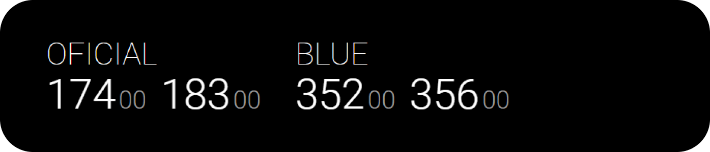
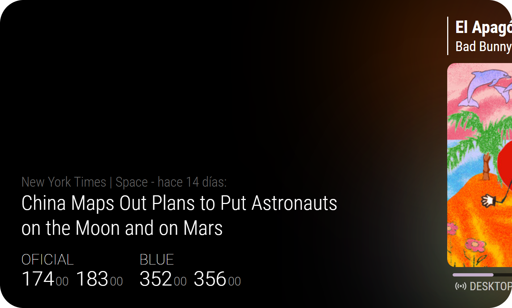

<picture>
  <source media="(prefers-color-scheme: dark)" srcset=".github/content/logo-fabrizz-white.svg">
  <source media="(prefers-color-scheme: light)" srcset=".github/content/logo-fabrizz-githubgray.svg">
  
</picture>

# MMM-DolarArgentina
This [Magic Mirror²](https://github.com/MichMich/MagicMirror) module allows you to view the current exchange rate for different USD/ARS types.
> This was inspired by [MMM-CurrencyArg](https://github.com/consus2903/MMM-CurrencyArg) from consus2903. As its not maintained anymore, (and the original api stopped working), this module was born.

<div><div>



# Instalation
- Clone this repository in your `modules` folder:

```bash
cd ~/MagicMirror/modules # Change acordingly to your folder structure
git clone https://github.com/Fabrizz/MMM-DolarArgentina.git
```

- Add the module to your `config/config.js` file, you can see a detailed list of configuration entries below.
```js
{
    module: "MMM-DolarArgentina",
    position: "bottom_left",
    config: {
        updateInterval: 43200, // Time (in seconds) between updates
        types: ["oficial", "blue"] // The types of currency to show
    }
},
```

### Configuration options
| Option | Type | Description |
| :--- | :---: | --- |
| `updateInterval:` | Number | Time in seconds between module updates. Can be set to 0 to only get data on init. |
| `types:` | Array | Array of currency names. Depends on the used API |
| `url:` | String | The API endpoint. [See below](#data-providers) |
| `animationSpeed:` | Number | Time in miliseconds of the fade in/out of the module |
| `useDynamicTheming:` | Boolean | [Future update] Use colors broadcasted from other modules. [See below](#dynamic-theming) |
  
### Data providers
| Provider | Endpoint |
| :---: | :--- |
| `Bluelytics` | [DEFAULT] https://api.bluelytics.com.ar/v2/latest |
| `Dolarsi` | [DEPRECATED] https://www.dolarsi.com/api/api.php?type=valoresprincipales |

# Dynamic Theming:
Uses the color data from other modules to dynamically style the module.


> This feature is planned for a future update, Im working in the modules and in a way of normalizing the colors / multiple providers
