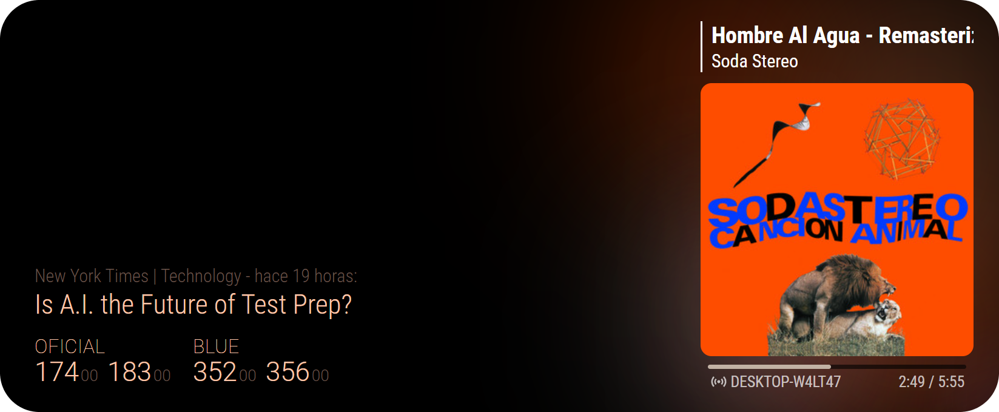

<picture>
  <source media="(prefers-color-scheme: dark)" srcset=".github/content/logo-fabrizz-white.svg">
  <source media="(prefers-color-scheme: light)" srcset=".github/content/logo-fabrizz-githubgray.svg">
  
</picture>

# MMM-DolarArgentina
This module for the [Magic Mirror²](https://github.com/MichMich/MagicMirror) allows you to view the current exchange rate for different USD types.

<div><div>


# Instalation
- Clone this repository in your `modules` folder:

```bash
cd ~/MagicMirror/modules # Change acordingly to your folder structure
git clone https://github.com/Fabrizz/MMM-DolarArgentina.git
```

- Add the module to your `config/config.js` file, you can see a detailed list of configuration entries below.
```js
{
    module: "MMM-DolarArgentina",
    position: "bottom_left",
    config: {
        updateInterval: 43200, // Time (in seconds) between updates
        types: ["oficial", "blue"] // The types of currency to show
    }
},
```

### Configuration options
| Option | Type | Description |
| :--- | :---: | --- |
| `updateInterval:` | Number | Time in seconds between module updates. Can be set to 0 to only get data on init. |
| `types:` | Array | Array of currency names. Depends on the used API |
| `url:` | String | The API endpoint. [See below](#data-providers) |
| `animationSpeed:` | Number | Time in miliseconds of the fade in/out of the module |
| `useDynamicTheming:` | Boolean | [Future update] Use colors broadcasted from other modules. [See below](#dynamic-theming) |

### Data providers:

# Dynamic Theming:
Uses the color data from other modules to dynamically style the module.



> This feature is planned for a future update, Im working in the modules and in a way of normalizing the colors / multiple providers

### Coordinator & Theme providers

The coordinator module calculates all the subcolors depending on the avaible data, also lets you synchronize the mirror theme with the exterior or viceversa.

For example using an MQTT addon you can connect to a smarthome system and you could set the theme with a virtual ligthbulb (Smarthome -> Mirror), or set the lights in a room to match the album cover colors (Mirror -> Smarthome).

 | [MAIN] Coordinator: | |
 | --- | --- |
 | [MMM-Colors](https://github.com/Fabrizz/MMM-Colors) | [MAIN MODULE] Use colors defined by an external device or other modules like the ones in the providers section |

Modules that bradcasts theme data to other modules:
 | Providers | Description |
 | :--- | :--- |
 | [MMM-NowOnSpotify](https://github.com/Fabrizz/MMM-NowOnSpotify) | Use album art colors, standalone or in conjunction to the MMM-Colors module |
 | [MMM-Colors](https://github.com/Fabrizz/MMM-Colors) | [MAIN MODULE] Use colors defined by an external device (Ex. match rgb ligthing) using MM2 notifications |

 ### Support for Dynamic Theming
 Modules that consume theme data:
 | Supported | Description |
 | :--- | :--- |
 | [MMM-NowOnSpotify](https://github.com/Fabrizz/MMM-NowOnSpotify) | Show whats playing on your Spotify, theme the elements and backdrop |
 | [MMM-Lyrics](https://github.com/Fabrizz/MMM-Lyrics) | Show lyrics for MMM-NowOnSpotify (or others), theme the lyrics, elements and backdrop |
 | [MMM-VisualNotifiactions](https://github.com/Fabrizz/MMM-Lyrics) | Show notifications from yor smarthome or others, theme the notifications |
 | [MMM-DolarArgentina](https://github.com/Fabrizz/MMM-DolarArgentina) | Show ARG-USD currency exchange rates, theme the display |

